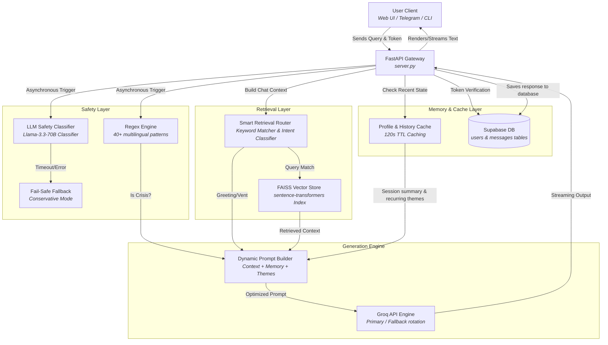

# RAAHAT (राहत) — AI-Powered Calming Mental Health Companion

[](https://github.com/AnimeshMudit/RAAHAT_TEST/actions/workflows/ci.yml)
[](LICENSE)
[](https://www.python.org/)
[](https://fastapi.tiangolo.com/)

> **Building a bridge between technology and tranquility.**
>
> RAAHAT is a dual-layer safe, context-aware conversational companion bridging the gap between clinical psychological protocols and everyday emotional support.

RAAHAT (राहत, meaning *Relief* in Hindi) is a specialized AI mental health companion designed to provide supportive, safe, and context-aware conversations. Unlike generic conversational agents, RAAHAT is built with a **Sandwich Architecture** where a Large Language Model (LLM) is encapsulated by strict regex-and-LLM safety guardrails and a local, high-performance vector database (FAISS) containing curated Psychological First Aid (PFA) and clinical workbooks. 

By prioritizing **privacy-first principles**, **local database state caching**, and **distinct client interfaces** (Web dashboard, Telegram bot, and CLI), RAAHAT delivers low-latency, empathetic interactions that support individuals dealing with stress, burnout, isolation, or anxiety. It is engineered with robust crisis detection that automatically routes to verified Indian helplines when high-risk language (English, Hindi, or Hinglish) is identified.

---

## 🛠️ Key Features

The RAAHAT ecosystem is designed for high reliability, responsiveness, and safety. Below is a detailed view of its current features:

| Feature | Description | Implementation Status |
| :--- | :--- | :--- |
| **AI Mental Health Companion** | Empathetic, supportive, non-clinical conversational responses kept under 3 sentences to match natural dialogue flow. | ✅ Fully Operational |
| **Emotional Presence Mode** | Detection of venting/non-advice phrases to provide active listening/reflection without pushing unsolicited coping mechanisms. | ✅ Fully Operational |
| **Crisis Detection** | Dual-layer hybrid model utilizing lightning-fast regex keyword scans and deep LLM classifier analysis. | ✅ Fully Operational |
| **Hindi Support** | Full recognition of Devanagari crisis inputs (e.g., "मैं मरना चाहता हूँ") for native language support. | ✅ Fully Operational |
| **Hinglish Support** | Robust parser patterns targeting romanized Hindi colloquial crisis queries (e.g., "marne ka mann kar raha hai"). | ✅ Fully Operational |
| **RAG Knowledge Base** | Ingestion of official PFA and CBT/DBT manuals using `sentence-transformers/all-mpnet-base-v2` embeddings and FAISS. | ✅ Fully Operational |
| **Streaming Responses** | Chunk-by-chunk response streaming using Server-Sent Events (SSE) via FastAPI's `StreamingResponse`. | ✅ Fully Operational |
| **Supabase Authentication** | Production-hardened email/password sign-in and Google OAuth integrations managed with Supabase Auth. | ✅ Fully Operational |
| **Session Memory** | Automatic Extraction of preferred names, session-level dominant emotions, and recurring themes. | ✅ Fully Operational |
| **Telegram Bot** | High-availability polling bot client. Note that Telegram and Web currently maintain separate user identities and conversation histories; cross-platform continuity is planned for a future release. | ✅ Fully Operational |
| **CLI Interface** | Low-overhead terminal-based local chat interface supporting offline vector search. | ✅ Fully Operational |
| **Web Interface** | Premium dark-themed dashboard featuring account onboarding, real-time streaming chat, and user profile management. | ✅ Fully Operational |
| **Docker Deployment** | Production-hardened multi-stage container configurations with isolated bind-mount splits for development vs prod. | ✅ Fully Operational |
| **Safety Evaluation Harness** | Offline test suite verifying safety classification metrics (Precision, Recall, F1) on high-risk and benign datasets. | ✅ Fully Operational |
| **CI/CD Validation** | Automated GitHub Actions workflow testing code compilation, safety metrics, and API smoke testing. | ✅ Fully Operational |

---

## 📐 Architecture Overview

RAAHAT isolates client interfaces from core backend services, channeling all communication through a secure, high-concurrency FastAPI gateway. The diagram below illustrates how a user message flows through the core logic pipeline to produce a response:



### Explaining the Layers:
1. **Client Layer:** RAAHAT supports three primary client interfaces: a web dashboard (HTML5/JS), a Telegram bot (`app/bot/telegram_bot.py`), and a CLI loop (`app/cli/main.py`). Currently, these clients maintain separate user identities and conversation histories. Cross-platform continuity is planned for a future release.
2. **FastAPI Gateway (`app/api/server.py`):** Coordinates API requests, validates JWT tokens, handles route rate-limiting, and controls multi-threaded execution.
3. **Safety Layer (`app/core/security.py` & `app/core/brain.py`):** Runs asynchronously alongside other operations to immediately flag crisis markers. If a crisis state is detected, the safety layer overrides the normal conversation loop and appends the crisis resource card.
4. **Memory & Cache Layer (`app/core/memory.py`):** Rather than querying the database repeatedly, RAAHAT fetches the chat history once, constructs the user context (including session summary and recurring themes), and caches the profile for 120 seconds.
5. **Retrieval Layer (`app/core/knowledge.py`):** Uses sentence embeddings to fetch relevant support guidelines from local vector data, bypassing retrieval for casual talk or greetings to reduce latency.
6. **Prompt Builder (`app/core/brain.py`):** Dynamically shapes the final LLM prompt. If a user has a recurring theme (e.g., *isolation*), it injects "soft awareness" without exposing the underlying memory mechanism.
7. **Groq Engine:** Communicates with Llama 3.3-70B via the Groq API. It supports API key rotation, automatically switching to a fallback key if a `429 Too Many Requests` status code is returned.

---

## 🛡️ Safety System

Safety is the core pillar of RAAHAT. The system features a **dual-layer pre-LLM and post-LLM security wrapper** designed to detect self-harm risk, active ideation, and severe emotional distress while ignoring casual slang metaphors.

```
                  [ USER MESSAGE ]
                         │
        ┌────────────────┴────────────────┐
        ▼                                 ▼
[ Semantic Safety Gate ]        [ LLM Classifier ]
(Multilingual MiniLM Model)    (SAFE/LOW/HIGH/CRISIS)
        │                                 │
        ▼                                 ▼
   Risk Score >= 0.80             Risk Score >= 0.55?
   Yes ──► CRISIS                 Yes ──► Run Groq Classifier
                                   No ──► SAFE (bypass LLM call)
```

### 1. Dual-Layer Verification Flow
- **Layer 1: Universal Semantic Safety Gate:** Uses a multilingual embedding model (`sentence-transformers/paraphrase-multilingual-MiniLM-L12-v2`) to compute the cosine similarity risk score between the user input and a set of predefined crisis/suicide reference phrases. High risk matches (similarity >= 0.80) trigger direct crisis state activation immediately.
- **Layer 2: Groq Llama-3.3 Classifier:** If the risk score is >= 0.55 (potential crisis or emotional venting), the query is sent to an isolated Llama-3.3-70B instance with a zero-temperature prompt to classify the message into one of four states: `SAFE`, `LOW`, `HIGH`, or `CRISIS`. Otherwise, it bypasses LLM classification entirely to minimize API latency.

### 2. Multi-Lingual Safety Coverage
Because it relies on a multilingual semantic space rather than literal keyword matches, the safety gate works out-of-the-box for:
- **English** (e.g., "I don't want to live", "I want to kill myself")
- **Hindi / Devanagari** (e.g., "मैं जीना नहीं चाहता")
- **Hinglish** (e.g., "Mera marne ka mann kar raha hai")
- **Tamil, Bengali, Marathi, Telugu, Kannada, Malayalam, and Urdu transliterations** (e.g., "enakku saaga thonuthu", "ami morar kotha bhabchi")

### 3. Hyperbole Filter
To prevent false positives, the system implements a hyperbole check. Common idioms such as *"dying of laughter"*, *"killing it at work"*, *"this is a killer design"*, or *"doing a killer job"* are removed or ignored before classification. The classifier uses context to distinguish true psychological distress from metaphorical venting.

### 4. Fail-Safe Mode
If the primary Groq API fails or rate-limits, RAAHAT activates a fail-safe fallback:
- If the regex scanner found a match, the system defaults to **CRISIS** state.
- If no regex matched, the system defaults to **HIGH** state as a conservative measure, ensuring the safety prompt is active and resources are appended.

### 5. Crisis Escalation & Helpline Card
When a crisis is activated, RAAHAT limits the LLM response to a warm, empathetic, non-robotic message of under 3 sentences, and appends a verified resource card:

```markdown
**Need immediate support? Approved Indian resources:**
- Kiran Mental Health Helpline: 14416 (24/7, free, multilingual)
- iCall: 9152987821 (Monday-Saturday, 10 AM-8 PM)
- Vandrevala Foundation: 1860-2662-345 or 9999-666-555 (24/7)
```

---

## 📚 RAG Pipeline

RAAHAT uses Retrieval-Augmented Generation (RAG) to ground its responses in verified mental health guidelines, including World Health Organization (WHO) stress management guides, Psychological First Aid (PFA) manuals, and Cognitive Behavioral Therapy (CBT/DBT) workbooks.

```
[ PDF MANUALS ] ──► [ Text Extraction ] ──► [ Hyphen & Space Cleaning ] 
                          │
                          ▼
                  [ Chunk Splitter ] (500 chars, 80 overlap)
                          │
                          ▼
                 [ Embeddings Model ] (all-mpnet-base-v2)
                          │
                          ▼
                 [ FAISS Vector Vault ]
```

### 1. Ingestion & Processing
- **PDF Extraction:** Built-in PDF reader ([knowledge.py](file:///C:/Users/mudit/Documents/RAAHAT_TEST/app/core/knowledge.py)) uses `pdfplumber` to process documents.
- **Linguistic Cleaning:** Standard WHO manuals frequently contain hyphenated words due to layout constraints. RAAHAT uses a cleanup script to automatically merge broken terms (e.g., `co- \n ping` -> `coping`) and normalize whitespace.
- **Surgical Chunking:** Text is split using `RecursiveCharacterTextSplitter` into **500-character chunks** with an **80-character overlap**. This keeps chunks focused, avoiding cross-topic dilution.
- **Normalized Vector Store:** Chunks are embedded using HuggingFace's `sentence-transformers/all-mpnet-base-v2` and saved to a local FAISS index. Vectors are normalized during indexing so that Euclidean L2 distance functions identically to Cosine similarity.

### 2. Smart Retrieval Router
To minimize latency and token usage, the system only queries the vector store when necessary. The `should_use_retrieval()` router evaluates the user's message and skips FAISS querying if:
- The message is a simple greeting or farewell.
- The user is asking about their own name or conversation state.
- The user has entered **Emotional Presence Mode** (e.g., *"not looking for advice, just venting"*).
- The message does not contain therapeutic keywords (e.g., *anxiety, grounding, breathing, cbt, panic*).

If a crisis is active and the user is not explicitly asking for grounding techniques, RAG is bypassed to ensure the safety message is clear and uncluttered.

### 3. Multi-Phrase Retrieval Matching
Instead of querying the vector store with a single long user query, the system uses the LLM to generate 3 short, comma-separated emotional search themes. RAAHAT splits these themes, queries the FAISS index for each, and unions the unique results. Chunks with similarity scores exceeding `1.15` are discarded to prevent irrelevant results.

---

## 🔑 Authentication

RAAHAT utilizes Supabase Auth for security, offering a secure bridge for both web and local application clients.

```
[ Web / CLI / Bot Client ] ──► JWT Bearer Token ──► [ FastAPI Middleware ]
                                                            │
                                                            ▼
                                                [ Supabase Auth Endpoint ]
                                                            │
                                                            ▼
                                                 Verify User ID & Email
                                                            │
                                                            ▼
                                                 [ Local Custom Profile ]
```

### 1. Supabase Auth Integration
- **Sign Up / Sign In:** Standard email and password hashing handled directly by Supabase. Custom user profiles are synchronized during authentication.
- **Google OAuth:** Managed through PKCE (Proof Key for Code Exchange). The server generates a redirect URL via `app/core/google_auth.py`, passes it to the client, and handles the PKCE callback via the `/auth/callback` endpoint.

### 2. JWT Verification Middleware
All protected endpoints (such as chat, history, and profile updates) require an `Authorization: Bearer <JWT>` header. The FastAPI dependency `get_current_user_id` verifies this token against Supabase Auth, retrieves the user's email, and matches it with the custom `users` database table.

### 3. Developer Bypass / Test Authentication
For automated testing and CI/CD pipelines, a developer bypass is available under strict conditions:
- **Conditions:** The environment must be set to `development`, `ENABLE_TEST_AUTH` must be `true`, and the request must originate from localhost (`127.0.0.1` or `::1`).
- **Mechanism:** Passing a token formatted as `mock-user-<email>` bypasses Supabase validation and links to a local test profile. This bypass is strictly disabled in production, failing fast and exiting the application if enabled incorrectly.

---

## 📂 Project Structure

RAAHAT separates **Logic (Brain)**, **State (Memory)**, and **Presentation (Static Interfaces)** to ensure a clean codebase:

```text
C:\Users\mudit\Documents\RAAHAT_TEST/
├── .github/
│   └── workflows/
│       └── ci.yml               # Automated CI (harness + backend smoke tests)
├── app/
│   ├── __init__.py
│   ├── api/
│   │   ├── __init__.py
│   │   └── server.py            # FastAPI endpoints, auth dependency & rate limiting
│   ├── bot/
│   │   ├── __init__.py
│   │   └── telegram_bot.py      # Telegram polling bot client using shared memory
│   ├── cli/
│   │   ├── __init__.py
│   │   └── main.py              # Local CLI interactive chat loop (Supabase-connected)
│   └── core/
│       ├── __init__.py
│       ├── behaviour_examples.json  # Few-shot emotional response examples
│       ├── brain.py             # LLM logic, regex crisis checks & prompt building
│       ├── google_auth.py       # Google OAuth URL generator helper
│       ├── knowledge.py         # FAISS vector store creation, split & multi-search
│       ├── memory.py            # Supabase database wrapper, session summaries & themes
│       ├── security.py          # Password hashing and email validation
│       └── session.py           # Conversational pattern detection (>5 turns)
├── data/                        # Curated PDF manuals (grounding, PFA, CBT/DBT workbooks)
├── docs/
│   └── images/                  # Placeholder paths for documentation screenshots
├── evaluation/                  # 10 clinical scenario files for evaluation
├── faiss_index/                 # Cached local vector store index files
│   ├── index.faiss
│   └── index.pkl
├── static/                      # HTML/CSS/JS frontend assets
│   ├── app.js                   # Web chat streaming controller
│   ├── chat.html                # Premium dark-theme dashboard UI
│   ├── landingpage.html         # Landing page introducing RAAHAT
│   ├── login.html               # Supabase sign-in/up & Google OAuth portal
│   └── onboarding.html          # Onboarding page for user name setting
├── tests/
│   ├── retrieval_tests.md       # RAG regression query targets
│   └── test_safety_evaluation.py # Offline/Online precision-recall evaluation harness
├── Dockerfile                   # Multi-stage production container setup
├── docker-compose.yml           # Production compose definition
├── docker-compose.dev.yml       # Dev compose mount override
├── requirements.txt             # Python application dependencies
├── run_api.py                   # Launcher: Web API (uvicorn app.api.server:app)
├── run_bot.py                   # Launcher: Telegram Bot
├── run_cli.py                   # Launcher: CLI Client
├── smoke_test.py                # End-to-end backend endpoint smoke test
├── check_rag.py                 # RAG indexing and search diagnostics utility
├── eval.py                      # Interactive evaluation runner script
├── test.py                      # Standalone conversational pipeline test harness
└── start_raahat.bat             # Batch launcher (Docker + Cloudflare tunnel + Web)
```

---

## 🚀 Installation

### Prerequisites
- Python 3.10 or 3.11 installed.
- Docker Desktop installed (if running containerized).
- A Supabase Project (Postgres Database + Supabase Auth enabled).
- A Groq API Key (and optional Fallback API Key).

---

### Local Setup

1. **Clone the repository:**
   ```bash
   git clone https://github.com/AnimeshMudit/RAAHAT_TEST.git
   cd RAAHAT_TEST
   ```

2. **Create and activate a virtual environment:**
   ```bash
   python -m venv venv
   # On Windows:
   venv\Scripts\activate
   # On macOS/Linux:
   source venv/bin/activate
   ```

3. **Install dependencies:**
   ```bash
   pip install -r requirements.txt
   ```

4. **Populate the environment variables:**
   Create a `.env` file in the root directory. See [Environment Variables](#environment-variables) below for details.

5. **Generate the FAISS Vector Database:**
   If the `faiss_index` folder is missing or you have added new PDFs to the `data/` folder, build the index:
   ```bash
   python -c "from app.core.knowledge import build_vector_store_from_folder; build_vector_store_from_folder('data')"
   ```

---

### Docker Setup

RAAHAT uses two Docker compose files: `docker-compose.yml` (production-hardened, no bind mounts) and `docker-compose.dev.yml` (mounts folders for hot-reloading).

#### Production Run:
Builds and runs the API server and Telegram bot in separate, isolated containers:
```bash
docker compose up --build
```

#### Development Run:
Enables hot-reloading by mounting the local folder:
```bash
docker compose -f docker-compose.yml -f docker-compose.dev.yml up --build
```

---

### Environment Variables

RAAHAT requires several environment keys to run. A template `.env.example` has been created with placeholders. Make sure to copy this into a `.env` file and populate it with your own credentials (never commit real secrets).

| Variable | Description | Required | Example Value |
| :--- | :--- | :--- | :--- |
| `GROQ_API_KEY` | Primary Groq API key for Llama 3.3. | Yes | `gsk_yH7...` |
| `FALLBACK_KEY` | Secondary Groq API key for rate-limit fallbacks. | No | `gsk_xL9...` |
| `SUPABASE_URL` | Your Supabase project URL. | Yes | `https://your-proj.supabase.co` |
| `SUPABASE_KEY` | Your Supabase anon/public key. | Yes | `eyJhbGciOi...` |
| `SUPABASE_ANON_KEY` | Your Supabase anon key (exposed to client config). | Yes | `eyJhbGciOi...` |
| `GOOGLE_CLIENT_ID` | OAuth Client ID from Google Cloud Console. | Yes (for Web Auth) | `102938-abc.apps.googleusercontent.com` |
| `GOOGLE_REDIRECT_URI` | Google Auth redirect callback endpoint. | Yes (for Web Auth) | `http://127.0.0.1:8000/auth/callback` |
| `ALLOWED_ORIGINS` | Allowed CORS origins (comma-separated). | Yes | `http://127.0.0.1:8000,http://localhost:8000` |
| `TELEGRAM_TOKEN` | Bot token provided by Telegram's @BotFather. | Yes (for Bot) | `123456789:ABCdefGhI...` |
| `ENVIRONMENT` | Operating environment (`development` or `production`). | Yes | `development` |
| `ENABLE_TEST_AUTH` | Allow mock token developer bypass (`true`/`false`). | Yes | `true` |
| `PERFORMANCE_LOGGING` | Log step timings to stdout (`true`/`false`). | No | `false` |
| `HF_TOKEN` | Optional HuggingFace token for gated model downloads. | No | `hf_...` |
| `DEBUG` | Enable debug printing and brain logs (`true`/`false`). | No | `false` |

#### Example `.env` File:
```env
GROQ_API_KEY=gsk_primary_key_here
FALLBACK_KEY=gsk_fallback_key_here
SUPABASE_URL=https://your-project.supabase.co
SUPABASE_KEY=your-supabase-public-anon-key
GOOGLE_CLIENT_ID=your-google-client-id.apps.googleusercontent.com
GOOGLE_REDIRECT_URI=http://127.0.0.1:8000/auth/callback
ALLOWED_ORIGINS=http://127.0.0.1:8000
TELEGRAM_TOKEN=1234567890:ABCdefGhIJKlmNoPQRsTUVwxyZ
ENVIRONMENT=development
ENABLE_TEST_AUTH=true
PERFORMANCE_LOGGING=true
DEBUG=false
```

---

## 🏃 Running The Project

RAAHAT features several execution entry points depending on the client interface needed:

### 1. Web Dashboard (Full Stack)
Start the FastAPI server:
```bash
python run_api.py
```
Open [http://127.0.0.1:8000](http://127.0.0.1:8000) in your browser. The app will open the landing page. Sign up or log in, complete the onboarding profile setup, and start a chat.

### 2. Telegram Bot
Ensure your `TELEGRAM_TOKEN` is configured in your `.env`, then start the bot service:
```bash
python run_bot.py
```
Search for your bot username on Telegram and send a message. Note: Chat history on Telegram is stored separately and does not sync with your account on the web interface.

### 3. CLI Client
Run the interactive console application:
```bash
python run_cli.py
```
Enter your credentials to log in (or register a new account) and chat directly in the terminal.

### 4. Windows Smart Launcher
If you are on Windows, you can double-click [start_raahat.bat](file:///C:/Users/mudit/Documents/RAAHAT_TEST/start_raahat.bat). This batch file will check if Docker is running, spin up the container services, initiate a secure Cloudflare tunnel, and open the web dashboard in your default browser.

---

## 📖 API Documentation

The FastAPI backend exposes several endpoints. When the server is running, the interactive OpenAPI documentation is available at [http://127.0.0.1:8000/docs](http://127.0.0.1:8000/docs).

### Key Endpoints:

#### `POST /api/signup`
Creates a user account in Supabase Auth and creates a profile record in the database.
- **Request:**
  ```json
  {
    "username": "user@example.com",
    "password": "Password123!"
  }
  ```
- **Response (200 OK):**
  ```json
  {
    "user_id": "90cf851a-d24b-4b10-85f8-b3026ad93ea8",
    "username": "user@example.com",
    "name": "",
    "needs_name": true,
    "is_new_signup": true,
    "session": {
      "access_token": "eyJhbG...",
      "refresh_token": "ref_...",
      "expires_in": 3600
    }
  }
  ```

#### `POST /api/login`
Authenticates user credentials against Supabase.
- **Request:**
  ```json
  {
    "username": "user@example.com",
    "password": "Password123!"
  }
  ```
- **Response (200 OK):**
  ```json
  {
    "user_id": "90cf851a-d24b-4b10-85f8-b3026ad93ea8",
    "username": "user@example.com",
    "name": "Animesh",
    "needs_name": false,
    "is_new_signup": false,
    "session": {
      "access_token": "eyJhbG...",
      "refresh_token": "ref_...",
      "expires_in": 3600
    }
  }
  ```

#### `POST /api/chat`
Submits a message and receives a response. Requires authorization token.
- **Headers:** `Authorization: Bearer <access_token>`
- **Request:**
  ```json
  {
    "message": "I'm feeling really stressed about exams",
    "preferred_name": "Animesh"
  }
  ```
- **Response (200 OK):**
  ```json
  {
    "response": "Exams can feel incredibly overwhelming, and it's completely normal to feel this pressure. Take a moment to pause. What's one small task you feel ready to tackle right now?"
  }
  ```

#### `POST /api/chat/stream`
Streams the response token-by-token using Server-Sent Events (SSE). Requires authorization token.
- **Headers:** `Authorization: Bearer <access_token>`
- **Request:**
  ```json
  {
    "message": "What is psychological first aid?"
  }
  ```
- **Output Stream:**
  ```text
  data: {"text": "Psychological"}
  data: {"text": " First"}
  data: {"text": " Aid"}
  data: {"text": " (PFA)"}
  ...
  ```

#### `GET /api/history`
Retrieves the recent chat history for the authenticated user.
- **Headers:** `Authorization: Bearer <access_token>`
- **Response (200 OK):**
  ```json
  {
    "history": [
      {
        "role": "user",
        "content": "Hello",
        "created_at": "2026-06-17T01:05:00.000Z"
      },
      {
        "role": "ai",
        "content": "Hi there. How can I help you?",
        "created_at": "2026-06-17T01:05:02.000Z"
      }
    ]
  }
  ```

---

## 🧪 Testing

RAAHAT includes a comprehensive test suite to validate the conversation pipeline, RAG retrieval quality, and safety configurations.

```
                  [ TESTS RUNNER ]
                         │
        ┌────────────────┼────────────────┐
        ▼                                 ▼
[ Smoke Tests ]               [ Safety Harness ]
(E2E HTTP check)             (Precision / Recall)
  - Signup / Login             - 20+ crisis scenarios
  - RAG Retrieval              - English / Hindi / Hinglish
  - Safety Interceptor         - Hyperbole false positives
```

### 1. Offline & Online Safety Evaluation Harness
The safety harness ([tests/test_safety_evaluation.py](file:///C:/Users/mudit/Documents/RAAHAT_TEST/tests/test_safety_evaluation.py)) evaluates the crisis detection system across 20+ test cases covering English, Hindi, Hinglish, and benign controls:
- **Layer 1 (Offline Deterministic):** Runs a mock classifier to verify that regex rules and offline triggers achieve 100% precision and recall.
- **Layer 2 (Live Integration):** Connects to the Groq API to validate the Llama safety classifier, enforcing **100% Recall** (no missed crises) and a minimum **90% Precision** (minimal false positives).

To run the harness locally:
```bash
python tests/test_safety_evaluation.py
```

### 2. End-to-End Smoke Tests
The smoke test script ([smoke_test.py](file:///C:/Users/mudit/Documents/RAAHAT_TEST/smoke_test.py)) validates the entire HTTP pipeline:
1. Simulates signup and login flows.
2. Checks RAG retrieval and response generation.
3. Tests the crisis interceptor to ensure a crisis message returns the appropriate helpline cards.
4. Performs regression checks using off-topic queries to verify they return 0 hits.

*Note: The FastAPI server must be running locally on port 8000 before starting this test.*
```bash
# In terminal 1:
python run_api.py
# In terminal 2:
python smoke_test.py
```

### 3. RAG Diagnostics
A utility script ([check_rag.py](file:///C:/Users/mudit/Documents/RAAHAT_TEST/check_rag.py)) validates the FAISS index:
- Confirms the index files (`index.faiss` and `index.pkl`) are loaded correctly.
- Performs an on-topic search check to verify guidelines are retrieved.
- Performs an off-topic search check to ensure zero false positives.
```bash
python check_rag.py
```

### 4. Interactive Sandbox Pipeline
To test prompt adjustments, context assembly, and crisis routing without starting the API server, database, or UI clients, use the interactive pipeline CLI:
```bash
python test.py
```

---

## ⚡ Performance Optimizations

RAAHAT is optimized for low-latency execution and efficient API usage:
1. **Asynchronous Parallel Orchestration:** Using FastAPI's async loops and a dedicated thread pool (`ThreadPoolExecutor`), RAAHAT runs crisis evaluation and vector database retrieval concurrently.
2. **Context and Profile Caching:** User profiles and history are cached in memory (`_context_cache` and `_profile_cache` with a 120-second TTL). This avoids repeated Supabase queries for consecutive messages.
3. **FAISS Database & Model Warmup:** Embedding models (both `all-mpnet-base-v2` for RAG and `paraphrase-multilingual-MiniLM-L12-v2` for safety) and the FAISS index are loaded and warmed up synchronously during FastAPI startup. This prevents lazy loading latency on the first request. The startup sequence fails fast and clearly if the FAISS index files cannot be found or loaded correctly.
4. **LRU Vector Search Cache:** The similarity search uses an LRU cache (`@lru_cache(maxsize=128)`) to store frequent queries. Repeating a query retrieves matches instantly.
5. **Context Window Compression:** The message history sent to the LLM is capped at 6-8 messages (3-4 turns). Older messages are summarized to fit the context window, keeping latency low and preventing token bloat.

---

## 🔒 Security Considerations

RAAHAT implements several layers of security to protect user data and ensure system stability:
- **JWT Signature Validation:** API routes verify signatures against Supabase Auth to prevent unauthorized database access.
- **Secure user sync (`/api/sync-user`):** The endpoint only executes with a verified Bearer JWT authenticated session. The backend resolves the verified identity from Supabase, extracts the authenticated email, and compares it to the request payload to reject mismatched emails or forged payloads with `401 Unauthorized`.
- **IP-Based Rate Limiting:** Limits endpoints to prevent abuse. Accounts are restricted to a maximum of 3 signup attempts and 5 login attempts per minute per IP address.
- **Password Constraints:** Enforces a minimum password length of 8 characters during signup.
- **SQL Injection Safeguards:** Supabase client bindings serialize and escape parameters to prevent injection vectors.
- **Backdoor Safety Gates:** The developer bypass is disabled outside of local development environments. Enabling it in production prints a critical error and shuts down the server.

---

## Known Limitations

1. **Telegram and Web identities are separate:** Users on Telegram and the Web dashboard have completely separate identities and conversation histories. Seamless continuity across these platforms is not currently supported.
2. **Single-instance deployment assumptions:** The application design and its state caching mechanisms assume a single-instance deployment model and do not natively support distributed multi-instance architectures.
3. **In-memory metrics and dashboard sessions:** Dashboard metrics, active sessions, and profile context caching are stored in the memory of the running process, meaning data in these metrics is instance-specific and reset when the server restarts.
4. **Current deployment is not multi-tenant:** The application handles security and database mappings tailored for a single-tenant workspace.
5. **Psychologist Edition is future work:** The specialized Psychologist/Clinician Portal and detailed review dashboards are not implemented in the current codebase.

---

## 🗺️ Roadmap

### Completed:
- Dual-layer crisis detection (Regex + LLM classifier).
- Support for Hindi and romanized Hinglish inputs.
- Local FAISS vector storage using `all-mpnet-base-v2`.
- Empathetic responses capped at 3 sentences.
- User memory profiling (name, emotions, themes).
- Web (HTML/JS), Telegram, and CLI clients.
- JWT auth, session caching, and rate limiting.
- Docker compose production and development workflows.
- Automated CI pipeline validation.

### In Progress:
- Multilingual voice chat support.
- Local browser SQLite synchronization for offline-first usage.

### Future Work:
- Progressive Web App (PWA) packaging for mobile installation.
- Expand local embedding models to support fully offline edge execution.
- Integrations with regional crisis centers.

---

## 📸 Screenshots

*Ensure the screenshot assets exist in your path before updating these image links.*

### 1. Secure Authentication Gateway

*Provides secure, rate-limited email/password sign-in and Google OAuth redirects.*

### 2. Calming Web Dashboard Chat Loop

*Responsive chat screen with real-time SSE streaming and warm, dark aesthetic styling.*

### 3. Crisis Detection Interception

*Crisis detection intercepting high-risk inputs and appending helpline details.*

---

## 🤝 Contributing

We welcome contributions from developers, designers, and mental health professionals.

1. **Fork the Repository:** Create a personal fork of the project.
2. **Create a Feature Branch:** `git checkout -b feature/AmazingFeature`.
3. **Maintain Code Standards:** Follow pep8 formatting and keep files documented.
4. **Run Validation Checks:** Ensure all tests pass before submitting a pull request:
   ```bash
   python tests/test_safety_evaluation.py
   python check_rag.py
   ```
5. **Open a Pull Request:** Explain your modifications and link relevant issues.

---

## 📄 License

Distributed under the MIT License. See [LICENSE](LICENSE) for more information.

---

> [!IMPORTANT]
> **Disclaimer:** RAAHAT is an AI conversational companion built for support and education. It does not provide clinical therapy, medical diagnoses, or psychiatric treatment. If you are experiencing a mental health emergency, please contact professional emergency services or reach out directly to the helplines listed in the safety section of this application.
