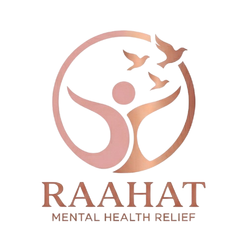
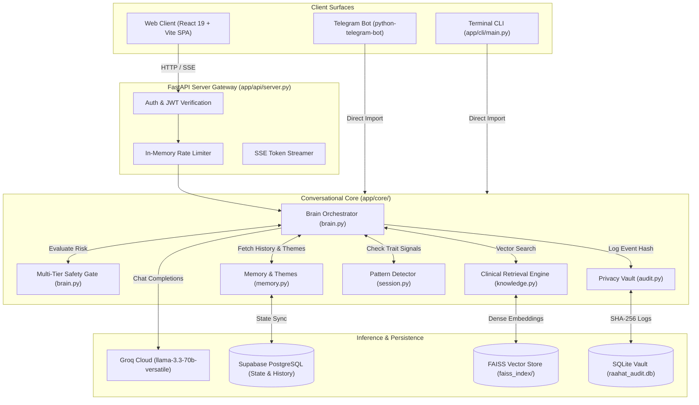
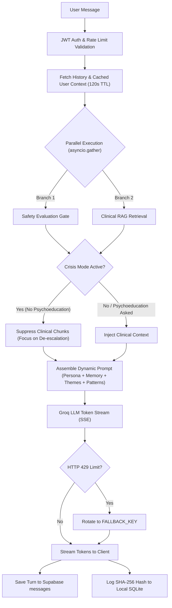
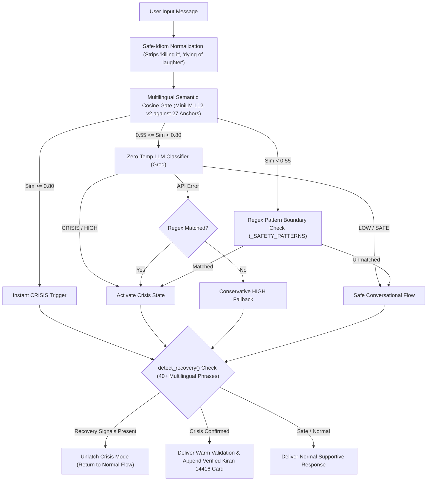
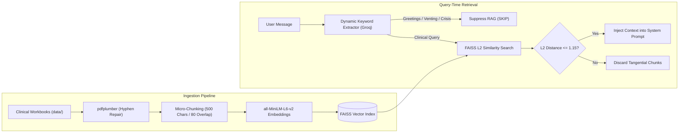
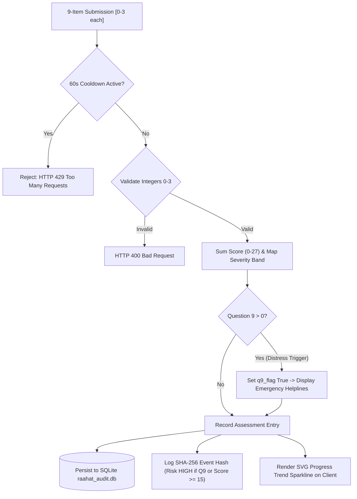

<p align="center">
  
</p>

# RAAHAT (राहत)

[](https://www.python.org/)
[](https://fastapi.tiangolo.com/)
[](https://react.dev/)
[](https://tailwindcss.com/)
[](https://github.com/facebookresearch/faiss)
[](LICENSE)
[](.github/workflows/ci.yml)

> **RAAHAT (राहत)** is an evidence-grounded conversational mental-health companion focused on psychological first aid (PFA), emotional grounding, multi-tier crisis detection, and contextual conversation across English, Hindi, and Romanized Hinglish.

---

## The Problem

Generic conversational systems are often poorly suited for emotionally sensitive conversations. Providing meaningful support requires balancing several competing engineering demands:

- Maintaining warm, non-judgmental conversational presence without offering unsolicited clinical advice or diagnostic pronouncements.
- Accurately classifying acute crisis signals across multilingual and colloquial expressions while ignoring harmless metaphorical slang (e.g., *"killing it"*, *"dying of laughter"*).
- Grounding coping techniques in curated psychological literature rather than relying on unstructured parametric model knowledge.
- Suppressing technical literature retrieval during active crises, venting, or casual conversation where clinical explanations would be harmful or intrusive.
- Ensuring fail-safe behavior under rate limits, API timeouts, and service outages.

RAAHAT addresses these challenges through a deterministic safety gate, curated clinical retrieval (RAG), and recency-weighted conversational context.

---

## What RAAHAT Does

- **Multi-Tier Crisis Gate:** Combines multilingual semantic embedding similarity, regex keyword anchors, and zero-temperature LLM classification across English, Devanagari Hindi, and Romanized Hinglish.
- **Evidence-Grounded Retrieval:** Ingests clinical workbooks (PFA, CBT, DBT, ACT) using micro-chunked FAISS vector storage, gated by dynamic query extraction and strict L2 relevance thresholds.
- **Context-Aware Memory:** Tracks psychological themes across sessions using linear time-decay weighting, 25-character negation lookback windows, and in-memory TTL caching.
- **Pattern Signal Detection:** Monitors conversational history after turn 5 for repeated cognitive patterns (e.g., catastrophising, rumination, helplessness, self-criticism).
- **PHQ-9 Self-Screening:** Provides an integrated 9-question depression screening workflow with cooldown enforcement, question 9 distress detection, and SVG trend visualization.
- **Multi-Surface Delivery:** Operates through a unified conversational core across a React 19 web SPA, a Telegram bot daemon, and an interactive terminal CLI.
- **Privacy-Oriented Auditing:** Logs SHA-256 hashed message representations to a local SQLite vault, decoupling audit compliance from plaintext storage.

---

## Key Engineering Highlights

- **Parallel Safety & Retrieval:** Executes crisis evaluation and vector retrieval concurrently via `asyncio.gather` on a dedicated `ThreadPoolExecutor` to minimize latency.
- **Anti-Latching Recovery Detection:** Prevents conversational deadlock by continuously checking for 40+ multilingual recovery tokens (*"i'm feeling better"*, *"main theek hoon"*) rather than latching crisis mode permanently across turns.
- **Retrieval Suppression Rules:** Dynamically suppresses RAG during greetings, memory queries, emotional venting, or active crises (unless the user explicitly requests coping techniques).
- **Deterministic Crisis Resource Injection:** Injects verified Indian emergency helpline numbers (Kiran 14416, iCall, Vandrevala) directly from backend configuration, eliminating LLM helpline hallucinations.
- **Negation-Aware Theme Matching:** Evaluates pre-match context with a 25-character lookback window to prevent false positives (e.g., classifying *"not anxious anymore"* as anxiety).
- **Time-Decayed Context Scoring:** Weighs messages linearly by recency ($w = \frac{idx + 1}{n}$), prioritizing active emotional concerns over historical context.
- **Token Budgeting & Key Failover:** Streams tokens via Server-Sent Events (SSE) with automatic failover between primary and secondary Groq API keys on HTTP 429 rate limits.
- **Zero-Trust User Sync:** Binds user identities strictly to cryptographically verified Supabase JWT claims, ignoring client-supplied request body emails.

---

## Architecture

### System Topology



### Request Lifecycle (`/api/chat/stream`)



---

## Safety Architecture

Safety evaluation in [`app/core/brain.py`](app/core/brain.py) executes prior to generating any response, enforcing conservative fail-safe classification:



- **Semantic Similarity Thresholds:**
  - **$\ge 0.80$:** Instant crisis trigger without waiting for external API verification.
  - **$0.55 \text{ to } < 0.80$:** Conditional trigger invoking the zero-temperature Groq safety classifier (`CLASSIFIER_SYSTEM_PROMPT`).
  - **$< 0.55$:** Bypasses LLM classification to save latency and token budget, relying on regex boundaries.
- **Multilingual Anchors:** Evaluated against 27 reference phrases across English, Devanagari Hindi (*"मैं मरना चाहता हूँ"*, *"आत्महत्या करने का मन कर रहा है"*), and Romanized Hinglish (*"marne ka mann kar raha hai"*, *"apni jaan de dunga"*).
- **Conservative Fail-Safe:** If the LLM classifier call fails, the system conservatively falls back to `CRISIS` if regex patterns match, or `HIGH` if they do not. It never falls back to `SAFE`.
- **Anti-Latching Recovery:** `detect_recovery()` tests for 40+ multilingual phrases (*"i'm safe"*, *"feeling better"*, *"main theek hoon"*), immediately unlatching crisis framing when the user indicates safety.
- **Deterministic Crisis Card:** When crisis mode is triggered, the backend appends verified national helpline numbers directly to the output.

---

## Evidence-Grounded Retrieval

The retrieval layer in [`app/core/knowledge.py`](app/core/knowledge.py) is designed to ground intervention-oriented responses in curated source material rather than relying solely on model-generated knowledge:



- **Chunking Strategy:** 500 characters with an 80-character overlap preserves localized grounding protocols (e.g., 5-4-3-2-1 sensory exercises, STOP skill) without diluted textbook context.
- **Relevance Filtering:** Chunks exceeding an L2 distance of $1.15$ are discarded to avoid injecting tangential background text.
- **Dynamic Keywords:** [`brain.generate_search_keywords`](app/core/brain.py) translates user expressions into clinical search terms. Retrieval is suppressed (`"SKIP"`) for greetings, memory recall, casual filler, emotional venting, or active crisis.

---

## Context & Memory

Memory operations in [`app/core/memory.py`](app/core/memory.py) maintain conversational continuity without naive keyword mismatches:

| Mechanism | Implementation | Purpose |
| :--- | :--- | :--- |
| **Linear Time Decay** | $w_i = \frac{i + 1}{n}$ for $i \in [0, n-1]$ | Progressively weights recent statements over older history. |
| **Negation Lookback** | 25-character window prior to keyword | Bypasses negated matches (*"not feeling anxious anymore"*, *"no longer sad"*). |
| **Semantic Disambiguation** | Context-scoped regex boundaries | Differentiates personal loss (*"lost my mother"*) from casual loss (*"lost my keys"*). |
| **Pattern Signals** | 5-turn ($> 10$ messages) activation gate | Injects structural trait awareness (*catastrophising*, *rumination*, *helplessness*). |
| **In-Process Cache** | 120-second TTL cache (`_context_cache`) | Avoids repeated database queries for user context and session summaries. |

---

## PHQ-9 Self-Screening

RAAHAT embeds a dedicated self-assessment interface based on the Patient Health Questionnaire-9:



- **Scoring & Severity Bands:** 9 integer responses (0–3 each) summed to an aggregate score (0–27): Minimal (0–4), Mild (5–9), Moderate (10–14), Moderately Severe (15–19), and Severe (20–27).
- **Distress Trigger (Question 9):** Evaluates passive/active death wishes; if $R_9 > 0$, the system sets a distress flag, presents immediate emergency helplines, and tags the event audit as `HIGH` risk.
- **Abuse Prevention:** Submissions enforce a strict **60-second cooldown** per user to prevent duplicate submissions and database pollution.
- **Trend Visualization:** Historical scores are tracked over time and rendered in the React interface using responsive, zero-dependency SVG sparklines.

> *PHQ-9 is used as a self-screening instrument and does not constitute a diagnosis.*

---

## Evaluation

RAAHAT employs a tiered testing and validation suite to prevent safety regressions:

| Evaluation Tier | Scope | Implementation | Purpose |
| :--- | :--- | :--- | :--- |
| **Unit Tests** | Offline unit verification | [`tests/test_memory.py`](tests/test_memory.py), [`tests/test_safety.py`](tests/test_safety.py), [`tests/test_phq9.py`](tests/test_phq9.py) | Memory time decay, negation rules, PHQ-9 scoring. |
| **Integration Tests** | API routes & auth verification | [`tests/test_api.py`](tests/test_api.py), [`tests/test_auth.py`](tests/test_auth.py) | JWT authentication, route protection, rate limits. |
| **Safety Benchmark Harness** | 25 curated crisis & control cases | [`tests/test_safety_evaluation.py`](tests/test_safety_evaluation.py) | Multilingual precision and recall validation. |
| **Live Smoke Tests** | End-to-end HTTP & SSE tests | [`smoke_test.py`](smoke_test.py) | Verifies live server boot, endpoints, and streaming. |

The safety evaluation harness ([`tests/test_safety_evaluation.py`](tests/test_safety_evaluation.py)) benchmarks the crisis classifier against English, Hindi, and Hinglish crisis statements as well as benign metaphor controls:
- **Layer 1 (Deterministic Offline):** Enforces 100% precision and 100% recall across mock test cases before deployment.
- **Layer 2 (Live API Integration):** Validates the live model against the evaluation dataset, enforcing 100% crisis recall and $\ge 90\%$ precision.

---

## Tech Stack

| Layer | Technology |
| :--- | :--- |
| **Backend Framework** | Python 3.10+, FastAPI, Uvicorn |
| **Frontend Application** | React 19, TypeScript, Vite, Tailwind CSS, Framer Motion |
| **Language Model & Inference** | Groq Cloud (`llama-3.3-70b-versatile`) with key rotation |
| **Vector Retrieval (RAG)** | FAISS (`faiss-cpu`), LangChain Splitters, `pdfplumber` |
| **Embedding Models** | `sentence-transformers/all-MiniLM-L6-v2` (RAG)<br/>`sentence-transformers/paraphrase-multilingual-MiniLM-L12-v2` (Safety) |
| **Databases** | Supabase PostgreSQL (State/Auth), SQLite (Local Hashed Audits) |
| **Alternative Interfaces** | `python-telegram-bot` (Telegram), Colorama (CLI) |
| **Containerization** | Docker (Multi-stage build), Docker Compose |
| **Testing** | Pytest, Custom Safety Benchmark Harness |

---

## Project Structure

```text
RAAHAT/
├── app/
│   ├── api/
│   │   └── server.py          # FastAPI application, auth guards, SSE streaming, rate limits
│   ├── bot/
│   │   └── telegram_bot.py    # Telegram daemon with shadow profile provisioning
│   ├── cli/
│   │   └── main.py            # Terminal CLI interactive interface
│   └── core/
│       ├── brain.py           # Safety gate, prompt construction, Groq LLM rotation
│       ├── knowledge.py       # PDF chunking, sentence embeddings, FAISS vector search
│       ├── memory.py          # Supabase history, theme decay, negation lookback
│       ├── session.py         # 5-turn structural cognitive distortion detection
│       └── audit.py           # SQLite privacy audit logger & PHQ-9 storage
├── frontend/                  # React 19 SPA source (builds into /static)
├── data/                      # 7 Clinical source PDF workbooks (CBT, DBT, ACT, PFA)
├── faiss_index/               # Pre-compiled FAISS vector index files
├── tests/                     # Unit, integration, and safety evaluation suites
├── Dockerfile                 # Multi-stage production container build
├── docker-compose.yml         # Container orchestration for Web and Telegram
├── requirements.txt           # Pinned backend dependencies
├── run_api.py                 # FastAPI local launcher
├── run_bot.py                 # Telegram daemon launcher
└── run_cli.py                 # Terminal client launcher
```

---

## Quick Start

### 1. Prerequisites
- Python 3.10 or 3.11
- Node.js 20+ and `npm`
- Git

### 2. Backend Setup
```bash
# Clone the repository
git clone https://github.com/AnimeshMudit/RAAHAT_TEST.git
cd RAAHAT_TEST

# Create and activate virtual environment
python -m venv venv
# Linux/macOS:
source venv/bin/activate
# Windows:
.\venv\Scripts\activate

# Install dependencies
pip install --upgrade pip
pip install -r requirements.txt

# Configure environment variables
cp .env.example .env
```
*Edit `.env` to supply `GROQ_API_KEY`, `SUPABASE_URL`, `SUPABASE_KEY`, and `SUPABASE_ANON_KEY`.*

### 3. Build Vector Store & Frontend
```bash
# Build FAISS vector database from data/ PDFs (if not already compiled)
python -c "from app.core.knowledge import build_vector_store_from_folder; build_vector_store_from_folder('data')"

# Build React 19 production assets into /static
cd frontend
npm install
npm run build
cd ..
```

### 4. Run the Application
```bash
# Run FastAPI server (http://127.0.0.1:8000)
python run_api.py

# Optional: Run Telegram Bot
python run_bot.py

# Optional: Run Terminal CLI
python run_cli.py
```

### 5. Run Tests
```bash
# Run unit test suite
pytest -v

# Run safety classifier benchmark
python tests/test_safety_evaluation.py
```

---

## API Overview

All protected endpoints require an `Authorization: Bearer <SUPABASE_JWT>` header.

| Method | Endpoint | Purpose |
| :--- | :--- | :--- |
| `POST` | `/api/chat` | Synchronous conversational message exchange. |
| `POST` | `/api/chat/stream` | Server-Sent Events (SSE) token streaming chat endpoint. |
| `POST` | `/api/sync-user` | Zero-trust Supabase JWT user provisioning and profile synchronization. |
| `GET` | `/api/user-profile` | Retrieves profile and display name metadata. |
| `POST` | `/api/phq9` | Submits 9-item PHQ-9 responses (enforces 60-second cooldown). |
| `GET` | `/api/phq9/history` | Retrieves historical PHQ-9 assessments for trend calculation. |
| `GET` | `/health` | Service liveness probe and component readiness check. |
| `GET` | `/metrics` | Operational performance and telemetry counters. |
| `GET` | `/dashboard/metrics` | Password-protected administrative metrics dashboard. |

*For complete implementation details and payloads, see [`raahat.md`](raahat.md).*

---

## Security & Privacy

- **Zero-Trust Token Validation:** `POST /api/sync-user` derives verified email addresses directly from verified Supabase JWT claims, ignoring untrusted client-supplied JSON payloads.
- **Service-Role Leak Prevention:** Startup audits and `/api/config` verify that administrative `service_role` keys are never exposed over public endpoints.
- **Sliding-Window Rate Limiting:** In-memory request trackers protect sensitive endpoints (`/api/login`, `/api/signup`, `/api/sync-user`, `/api/phq9`) from brute-force attempts.
- **Cryptographic Audit Trails:** Event records in `raahat_audit.db` store SHA-256 hashes of message text. Plaintext transcripts are retained only in Supabase for conversation memory, ensuring local audit logs remain privacy-preserving even in the event of local disk inspection.

---

## Documentation

- **Architecture Deep Dive:** Consult [`raahat.md`](raahat.md) for complete technical notes, design trade-offs, and module walkthroughs.
- **Data Source Annotations:** Consult [`DATA_SOURCES.md`](DATA_SOURCES.md) for clinical workbook origins and licensing notes.

---

## Clinical / Reference Sources

RAAHAT's retrieval corpus is assembled from curated psychological, psychosocial, and stress-management materials located in [`data/`](data/):

1. **Acceptance and Commitment Therapy Workbook:** Exercises for psychological flexibility and mindfulness.
2. **CBT Group Program for Depression: Patient Manual:** Cognitive reframing and behavioral activation *(Univ. of Michigan Medicine)*.
3. **DBT Crisis Survival Skills Workbook:** Distress tolerance, TIPP skills, and self-soothing protocols.
4. **Definitions & Examples of 15 Cognitive Distortions:** Identification of thinking traps and unhelpful cognitive frames.
5. **Grounding Exercise Guide:** Somatic de-escalation protocols and 5-4-3-2-1 sensory grounding.
6. **A Short Introduction to Psychological First Aid:** Non-intrusive emotional support principles *(IFRC Reference Centre)*.
7. **Doing What Matters in Times of Stress:** Illustrated stress management guide *(World Health Organization, CC BY-NC-SA 3.0 IGO)*.

---

## Medical & Emergency Disclaimer

> [!CAUTION]
> **RAAHAT is NOT a clinical diagnostic tool, licensed medical provider, psychotherapy service, or crisis intervention hotline.**
>
> It does not provide medical diagnoses, clinical treatment plans, or emergency crisis management. If you or someone you know is in acute distress, experiencing thoughts of self-harm, or in immediate danger, please reach out to professional emergency services:
>
> - **Kiran Mental Health Helpline (India):** [`14416`](tel:14416) *(Toll-free, 24/7, multilingual)*
> - **Tele-MANAS:** [`14416`](tel:14416) / [`1800-891-4416`](tel:18008914416) *(Govt. of India, 24/7)*
> - **Vandrevala Foundation Helpline:** [`9999-666-555`](tel:9999666555) / [`1860-2662-345`](tel:18602662345) *(24/7)*
> - **iCall Psychosocial Helpline:** [`9152987821`](tel:9152987821) *(Mon–Sat, 10:00 AM – 8:00 PM IST)*
> - **International Resources:** [Befrienders Worldwide](https://www.befrienders.org/) / [Find A Helpline](https://findahelpline.com/)

---

## License

This project is licensed under the [MIT License](LICENSE).
